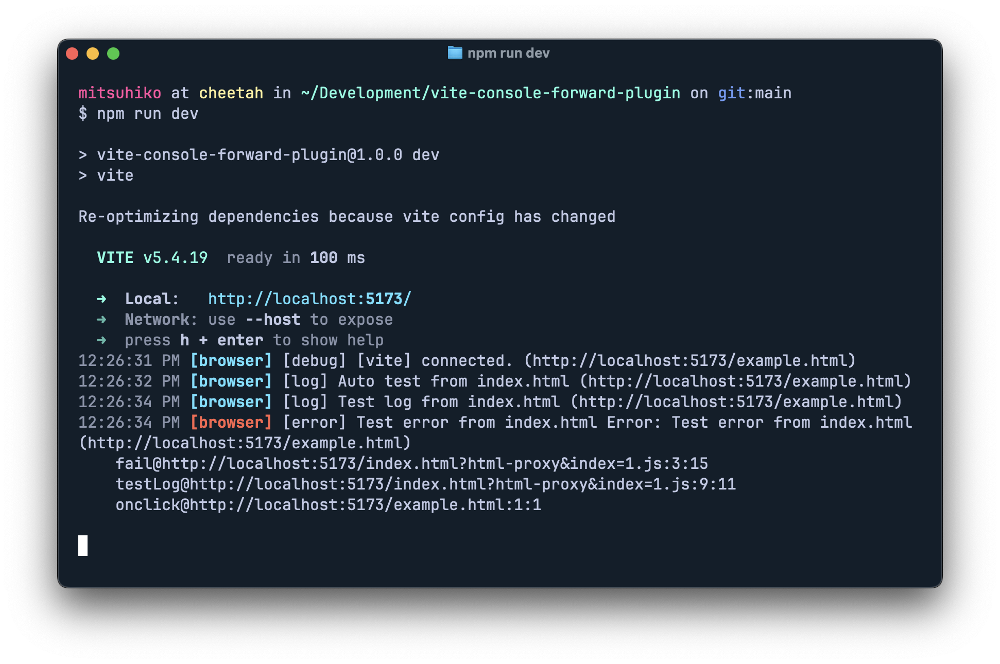

# vite-console-forward-plugin

A Vite plugin that forwards browser console logs to the Vite dev server console for better debugging experience during development.

## What it does

This plugin intercepts browser console logs (`console.log`, `console.warn`, `console.error`, etc.) and forwards them to your Vite dev server console with module-aware tracking. This is particularly useful when:

- Debugging client-side JavaScript in environments where browser dev tools aren't easily accessible
- You want to see all application logs in one place with module context (e.g., `[background]`, `[content]`)
- Working with mobile devices or embedded browsers
- Running automated tests and want console output in your CI logs
- Developing browser extensions where logs from different contexts need to be tracked separately



## Installation

Since this is a single-file plugin, you can copy `vite-console-forward-plugin.ts` directly into your project, or install it as a local dependency.

## Usage

Add the plugin to your `vite.config.ts`:

```typescript
import { defineConfig } from "vite";
import { consoleForwardPlugin } from "./vite-console-forward-plugin";

export default defineConfig({
  plugins: [
    consoleForwardPlugin({
      // Enable console forwarding (default: true in dev mode)
      enabled: true,

      // Custom API endpoint (default: '/api/debug/client-logs')
      endpoint: "/api/debug/client-logs",

      // Which console levels to forward (default: all)
      levels: ["log", "warn", "error", "info", "debug"],

      // Auto-inject into specific files (useful for browser extensions)
      injectPatterns: [
        "/entries/background/index.ts",
        "/entries/content/index.ts",
        "/entries/popup/index.tsx",
        "/entries/inpage/index.ts",
      ],

      // Custom module name extraction from file paths
      moduleExtractor: (id: string) => {
        if (id.includes("/entries/background/")) return "background";
        if (id.includes("/entries/content/")) return "content";
        if (id.includes("/entries/popup/")) return "popup";
        if (id.includes("/entries/inpage/")) return "inpage";
        return "extension";
      },
    }),
  ],
});
```

## Configuration

The `consoleForwardPlugin` accepts an options object with the following properties:

| Option            | Type                             | Default                                     | Description                                        |
| ----------------- | -------------------------------- | ------------------------------------------- | -------------------------------------------------- |
| `enabled`         | `boolean`                        | `true`                                      | Whether to enable console forwarding               |
| `endpoint`        | `string`                         | `"/api/debug/client-logs"`                  | API endpoint path for receiving logs               |
| `levels`          | `string[]`                       | `["log", "warn", "error", "info", "debug"]` | Console levels to forward                          |
| `injectPatterns`  | `string[]`                       | `undefined`                                 | File patterns to auto-inject console forwarding   |
| `moduleExtractor` | `(id: string) => string`         | Built-in path parser                        | Custom function to extract module names from paths |

## Browser Extensions

For browser extension development, use `injectPatterns` to target specific entry points:

```typescript
consoleForwardPlugin({
  enabled: isDev,
  injectPatterns: [
    "/entries/background/index.ts",
    "/entries/content/index.ts", 
    "/entries/popup/index.tsx",
  ],
  moduleExtractor: (id) => {
    if (id.includes("/background/")) return "background";
    if (id.includes("/content/")) return "content"; 
    if (id.includes("/popup/")) return "popup";
    return "extension";
  },
})
```

This will show logs like `[background] User logged in` or `[content] Page loaded`, making it easy to track which part of your extension is generating each log.

## How it works

1. **Client-side**: The plugin transforms your code to patch browser console methods
2. **Module tracking**: Each log is tagged with its source module for better organization
3. **Buffering**: Console logs are buffered and sent in batches to reduce network overhead
4. **Server-side**: A middleware endpoint receives the logs and outputs them using Vite's logger with module prefixes
5. **Formatting**: Logs maintain their original formatting and include stack traces for errors
6. **Error handling**: Network failures are handled gracefully without breaking your application

## License

MIT
